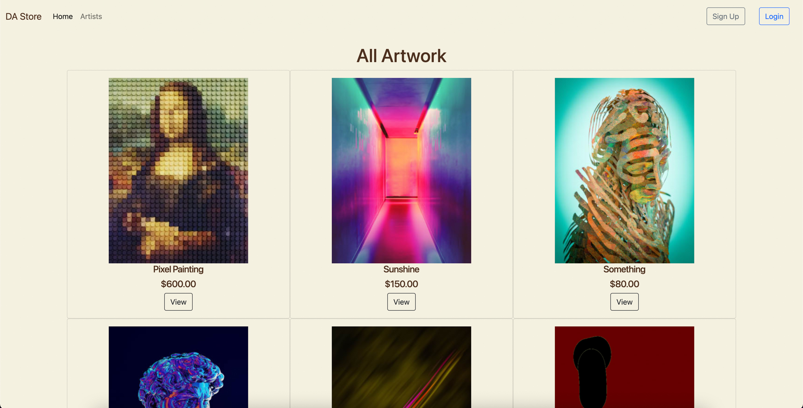
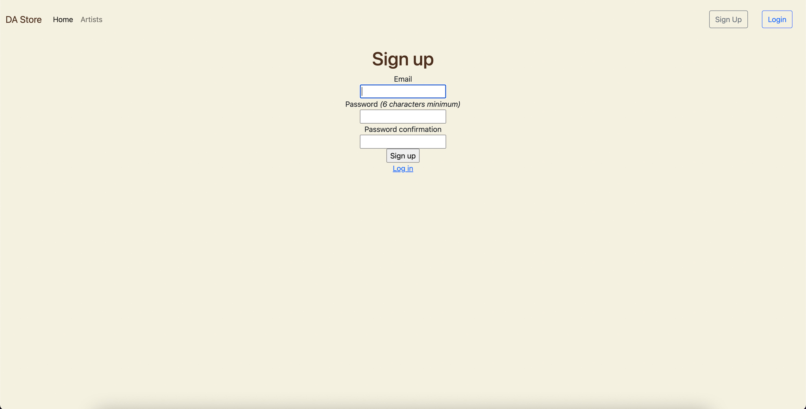
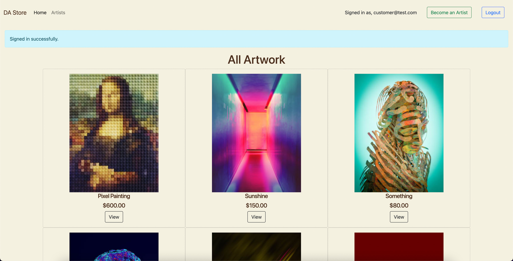
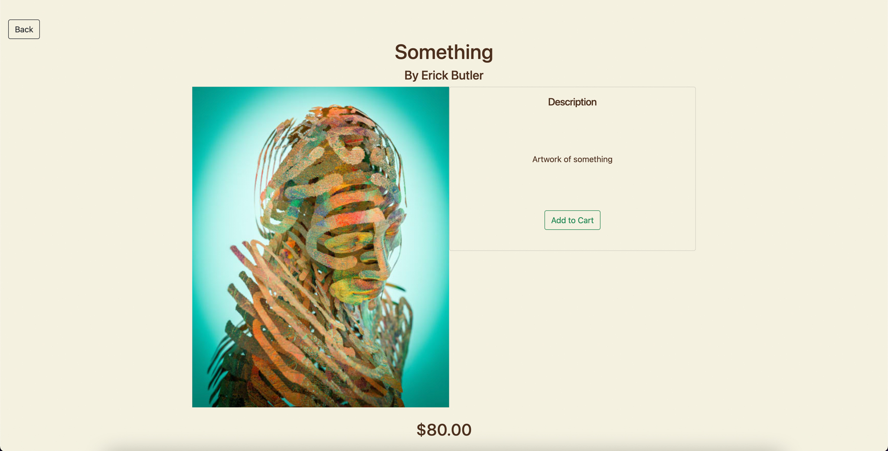
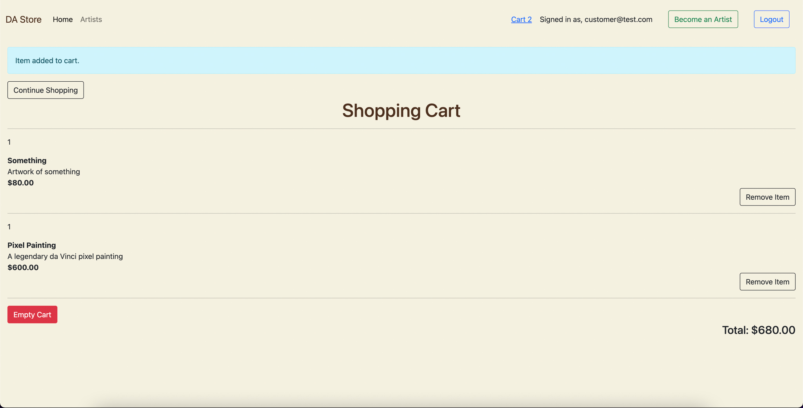
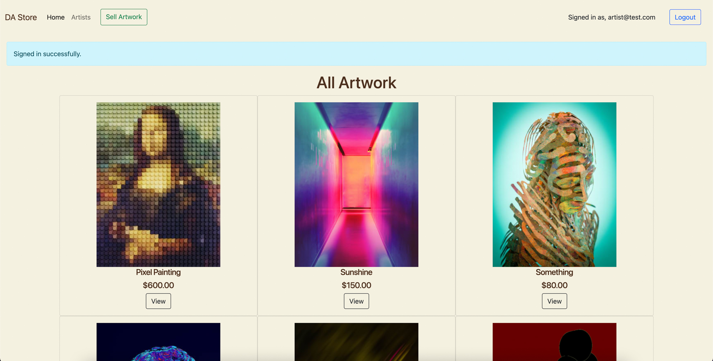
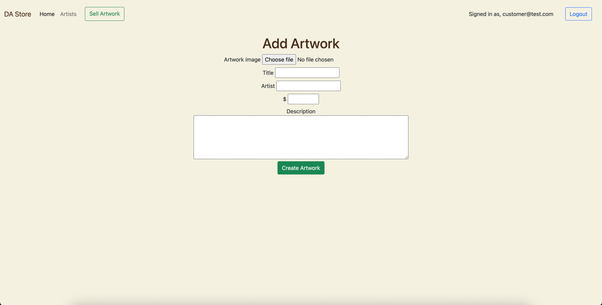
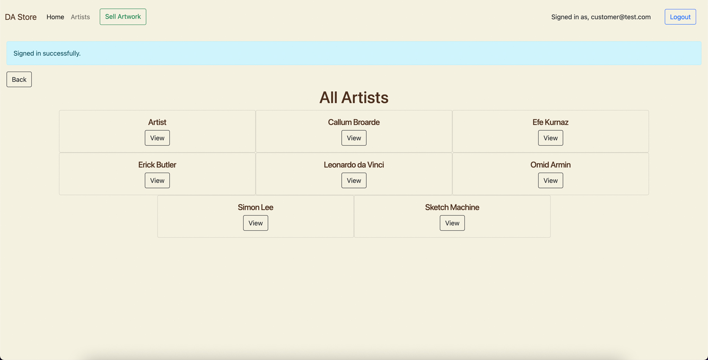

# Marketplace App 
### Digital Art Store
---
#### Link to Marketplace app:
https://fathomless-retreat-58210.herokuapp.com/

---

#### Link to Github repo:

---
#### Description:
Welcome to my marketplace application, Digital Art Store. This marketplace app is where graphic designers, animators and all digitally made art, can be put on display in the once place and sold to interested buyers, without limitations. DA Store, provides a simple marketplace platform where artists and consumers can come together to find all art made digitally. This can range from, still or moving art made on computers, to phsycial art, like paintings being uploaded to the digital world to be purchased.

---
#### Purpose and Issue being solved:
The idea behind this application, came from the poor algorithm that was introduced to popular social media platforms like instgram, facebook etc. These algorithms depict what posts the end-users would want to see, based on their search history and other information gathered. This has caused major issues for artitsts and businesses, that use these platforms to promote and sell their products, as targeted audiences are being chosen for them, limiting the natural growth of new products becoming available and being seen by the end-users.

---
#### Functionality & Features:
Digital Art Store's home page immediately displays all artwork that has been posted by artists to the website in cards, displaying the artwork image, title, artist name and price. The artwork displayed is in order of most recently poste by the artists. When clicked on, the user is taken to a more detailed page of the artwork, displaying the image larger, with the description and a 'add to cart' function.

Guest users (Not signed up) are limtited to only viewing the home page and will be redirected to a login/sign up page, if other functions are attemped. 

Users that are signed up as customers (The default signup role), will have access to viewing individual artwork, filtering the view to see all the artists in alphabetical order and have access to added the artwork of their choice to their shopping cart.

Users that are signed up as artists, have access to all features that a customers has, as well as the added functions of uploading, editing and deleting their artwork uploaded. Artists remain the feature of purchasing artwork, to save users having more than one account.

Artwork that is uploaded, displays and image of the artwork itself (moving or still), the title of the artwork, the name of the artist, the price they want to sell the artwork for and a description of the art.

---

#### MVC Architecture:
The marketplace application uses the MVC (Model, View, Controller) architechture through the ruby on rails framework, creating a dynamic functionality between the structure. It is through the use of inheritance between classes, models and the database within this framework, that depics the structure of the MVC architechture. Inheritance, means all methods and attributes from the Parent becomes available in the Child i.e. The Artwork model, is inherited from the ApplicationRecord model, and the ApplicationRecord model is inherited from the ActiveRecord model. This type of structure allows different models and controllers to be Child of it's Parent controller or model, creating a tree type stucture of the application and its relations.

---
#### Sitemap:
My application consists of 5 pages if you're logged in as an artist, 4 if you're a customer and 1 if you're a guest without an account. Starting at the index page, you can navigate to the view page, add artwork page or all artists page via the navbar or clicking on a peice on artwork. From the view page you can add that artwork to your cart and visit the shopping cart from there. All pages can reach the logout function. Logged in as a customer, has all features minus the add artwork page.

---
#### Screenshots:

---
#### Target Audience:
The target audience for my marketplace app, is graphic designers and Artists looking to sell and advertise their work in the one place without limitations from the platform. As well as users interested in purchasing artwork digitally.

---
#### Tech Stack:
html, css & bootstrap, ruby on rails, javascript, heroku, postgresql

---
#### User Stories & Planning:
I implemented the use of Trello, to plan and complete the tasks required to finish the marketplace application. Starting out with a list of simple user stories in the to-do section, helped me identify what i wanted users to be able to achieve within the app. Once the user stories covered the main features, i then broke down each user story into a checklist of things i needed to do, to achieve each user story. Moving each task through the stages of the trello board, kept a clear checklist of what was complete and what needed to be done, with the steps provided in each.

Trello Board Link: https://trello.com/invite/b/owahp0w2/ee99e8d1c9f43c3680a2ab0a3e7084c6/digital-artstore

---
#### Wireframes:

---
#### ERD/Schema:

---
#### High Level Components (Abstractions):
The abstractions required for my marketplace application are,

**Artwork Model:**
This model deals with all the data involved with each piece of artwork uploaded by artist users, storing it in the artwork entity in the database. The data involved being the title, artist name, price and description, as well as, working with the cloudinary service to attach the image to each artwork piece. This model talks with the artwork controller to deliever render various views the artwork has for the end-user. These views being, 
- Index: The Index view, is the home page displaying all the artwork in the database. 
- Show: The Show view, displays each individual peice of artwork, with all its data.
- Edit: Renders the Form view, to display the data of any selected artwork, with editing capablilties to update the database.
- New: Also renders the form view, to display the data fields needed for a piece of artwork to be uploaded to the site and database.
- Artists: The Artists view, displays all the artists in alphabetical order with the option to view their artwork.
- Form: Displays the data fields for artwork to be uploaded to the site and database.

**User Model:**
The User Model, handles the data for users like their email and password, as well as, reset password tokens, reset password time stamps and the created timestamp of the user.This data gets stored in the users entity on the database. This model is created through the use of the gem Devise.

**Role Model:**
The Role Model, handles the data for different roles used in the application, like the customer role, artist role and admin role. This data is connected to the users entity, through a join table called users roles. This allows different users to have one or many roles, giving them restrictions or access to certain things within the application. This is achieved through the gem called rolify. 

**Cart Model:**
The Cart Model, handles the data from the line items entity that is added to that entity, from the artwork entity. This model talks to the cart controller to render the view of the cart using the data consisting of line items. In this case, the view is called Show. 

**Line Item Model:**
The Line Item Model, stores data added from the artwork entity, into the line items entity, acting as a middle man for the cart model to the artwork model, to retreive the the line items and be displayed in the cart view. The line items view is rendered within the cart view, allowing users to add and remove items from their cart.

---
#### Third Party Services:
The third party services used in my application are,
- Cloudinary: Which handles the image uploading to the application
- Heroku: Used to deploy the application to a public server
- Postgresql: Used at deployment stage as the main database for the application

---
#### Project Models (Active Record Associations):
The Artwork model has a has_one_attached relationship with artwork_images retreived from cloudinary, as well as a has_many relationship with line_items, meaning one peice of artwork can have many line_items, which allows the artwork to be added to the line_items entity for the cart to display these line_items.

The LineItem model, has a belongs_to relationship to the artwork, as well as the cart. This connects these two entities with the line_items entity being the middle man.

The Cart model, has a has_many relationship to the line_items entity, similarly to the artwork entity, as the line_items entity belongs to the Cart and Artwork.

The Role model, has a has_and_belongs_to_many relationship to the users entity, with a join table to the users_roles entity.

---
#### Database Relations:
The Role entity has a has_and_belongs_to_many relation to the Users entity, through a join table called Users roles which has a many to many relation, making it required to be in a join table. The Cart entity has a has_many relation to the line_items entity, which has a belongs_to relation to the Cart and Artwork entities. The Artwork entity has a has_one_attached to the artwork_image entity, connecting cloudinary to the Artwork model, and also has a has_many relation to the line_items entity. 

